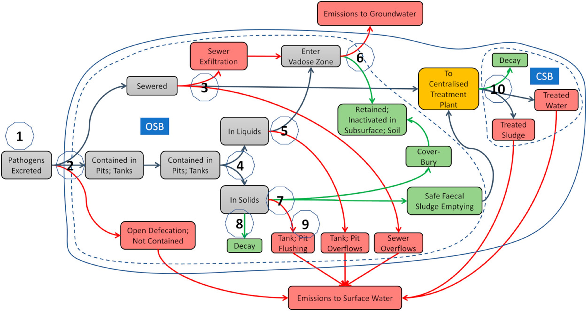
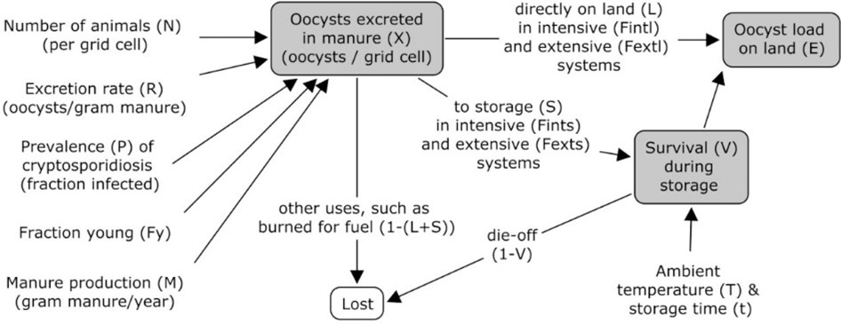
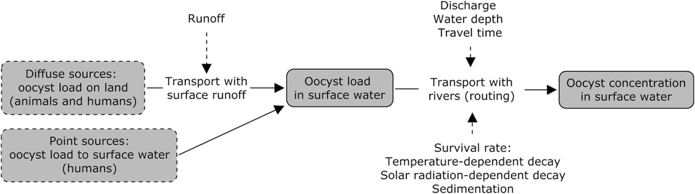

# The GloWPa model

The GloWPa (Global Waterborne Pathogen) model simulates emissions and concentrations of pathogens (currently Cryptosporidium, rotavirus and E. coli) to/in surface water and consequent health risks. Cryptosporidium and rotavirus are known to be a leading cause of diarrhoeal diseases globally and E. coli is a widely used indicator bacterium. These pathogens represent protozoans, viruses and bacteria. GloWPa focuses on human and livestock emissions of pathogens that end up in surface water systems through various pathways. Special attention is paid to the storage and removal of pathogens in manure storage facilities or wastewater treatment systems. The concentration of the pathogens is calculated using the human and livestock emissions and information on hydrology. 

The GloWPa model has been developed for different spatial scales, including global, for Uganda and China, for Kampala. The spatial resolution is usually an administrative boundary level and is flexible. The model output is provided for a grid. The resolution of this grid is flexible and ranges from ~ 50x50 km latitude x longitude to 200m. The temporal resolution is usually a monthly time step. The model is a static model, which means that it is run for a particular year, such as 2010, 2015 or 2020. The model is used in scenario analysis in which future years are analysed, such as 2030, 2050 or 2100.

The GloWPa model simulates pathogen emissions (or loads), concentrations and health risks according to assumptions and equations. The model provides spatially continuous outputs. The relative differences between different locations, sources, scenarios, future years etcetera are much more important than the exact values for specific grids and years that the model produces. With the model we can provide an understanding of pathogen emissions, concentrations and/or risks in an area where there are no data. Additionally, we can assess hotspot areas with high emissions, concentrations and/or risk, identify key sources of the emissions, concentrations and/or risk, and evaluate trends over time. Scenario analysis enables us to assess the impact of socio-economic development and climate change on the emissions, concentrations and/or risk, and it helps to evaluate the effectiveness of interventions.

The Global Waterborne Pathogen (GloWPa) model has been developed over the years and we constantly work to improve it. For the purposes of the WaterPath Toolkit, the GloWPa model code has been developed into an R package. The package is available for download here: <a href="https://waterpath-toolkit.org/model">https://waterpath-toolkit.org/model</a>.

The model is currently divided into four essential parts:
* Human Emissions
* Livestock Emissions
* Concentrations
* Risk

## Human Emissions
The human emissions or loads part of the model has been developed to simulate the number of faecally excreted pathogens reaching surface water from human sources. These human sources include 13 onsite sanitation categories. These sanitation categories have also been used by the Joint Monitoring Programme of WHO/UNICEF.

The flow of the pathogens through the systems is provided in Figure 1. The pathogens are followed from the source to the surface water and fate and transport processes are incorporated where appropriate. Main input data include population, other demographic data including urbanization rate and fraction of children younger than five years of age, prevalence of infection and excretion rates, sanitation fractions, for onsite systems the frequency of emptying of the onsite system, wastewater and faecal sludge treatment.
 

<b>Figure 1.</b> Schematic of the most recent version of the human emission model (Musaazi et al 2020). Pathogens flow through the onsite sanitation boundary and the centralised sanitation boundary. The
grey, green and red arrows indicate standard, safe or unsafe pathways, respectively. Pathogens are: (1)
excreted; (2) initially contained; (3) conveyed by sewerage and emitted via sewerage leaks, overflows or
exfiltration; (4) associated with onsite technologies liquid or solid waste fractions; (5) in the liquid fractions of
septage and emitted to the vadose zone via leach fields or to surface water when leach fields are absent; (6)
emitted to groundwater or retained/inactivated in the subsurface; (7) present in solid faecal sludge or septage
and emptied to treatment, covered and buried, or emitted to surface water; (8) decayed in onsite pits or tanks;
(9) informally flushed from the solid onsite fraction to surface water and (10) at centralised treatment plants
and are inactivated or discharged to surface water in liquid effluent or sludge/biosolids (Okaali et al 2022).
 

## Livestock emissions

The GloWPa model calculates livestock oocyst emissions (or loads) to land. This accounts for all oocysts in manure that is dropped directly on land, and the proportion of oocysts that survive in manure that is stored before it is applied to land. 

The main input data for the model include: number of animals, pathogen prevalence and oocyst excretion rates, manure production and storage estimates, intensive and extensive farming systems and ambient temperature. The setup of the model is explained in Figure 2.

<b>Figure 2.</b> Schematic of the livestock emission model (Vermeulen et al 2017). Gray boxes represent the major subcomponents that are calculated, the white box represents the oocysts that are lost, and the text without boxes are model inputs. The oocyst load to land (E) is the main model output.

## Concentrations

The human and livestock emission data are used with information on hydrology to determine pathogen concentrations. Within the study area, the water moves downhill from one grid to the next. In each grid human and/or livestock emissions are added to the water. Additionally, fate and transport processes are applied. Then the water moves to the next grid, using the upstream concentrations and the emissions in that next grid etcetera. 

Figure 3 provides an overview of the concentration model. Input data include runoff and discharge from hydrological models, together with the flow direction and accumulation files that are also used for the hydrological models and can be derived from digital elevation maps. Additionally, information on the travel time and decay rates are required. 

<b>Figure 3.</b> Schematic of the concentration model (Vermeulen et al 2019). This figure shows the ‘flow’ of oocysts from diffuse and point sources on the left to the concentrations in rivers on the right. In between, processes that are calculated are the transport with surface runoff, the transport with rivers (routing) and oocyst survival. Dotted arrows show the major influencing variables (runoff, discharge, water depth and travel time, and the survival rate as affected by temperature, solar radiation and sedimentation). The diffuse and point sources are presented in boxes with dotted lines, as they are not calculated in this current study, but in the GloWPa-Crypto H1 and L1 models.

## Risk

The concentrations simulated by the model can be used in Quantitative Microbial Risk Assessment. First attempts to add QMRA using GloWPa results include Hofstra et al 2019, where QMRA was applied globally for the population drinking surface water directly and Limaheluw et al 2019, where QMRA was applied for the population using surface water for drinking directly and after treatment in sub-Sahara Africa. The QMRA script has not yet been added to the R package, but will be added within the Waterpath project.
Input data for the QMRA model are the concentrations from GloWPa, the intake by a person during an exposure event, such as drinking or swimming or other activities, and dose-response information. To further simulate the number of cases or the disease burden, more information is required on the number of people that encounter exposure events. 

## References

The following publications provide the best available overview of the model:

<ul>
<li><a href="http://www.sciencedirect.com/science/article/pii/S0048969712012958">Hofstra et al. 2013</a>&nbsp;is the first version of the model and explores opportunities to model <em>Cryptosporidium </em>at a global scale.</li>
<li><a href="http://iopscience.iop.org/article/10.1088/1748-9326/10/9/094017/meta;jsessionid=83AE536506678688B7C679931271E9BB.c3.iopscience.cld.iop.org">Vermeulen et al. 2015</a>&nbsp;look further at the human&nbsp;<em>Cryptosporidium&nbsp;</em>emissions, adding the population that does not have access to sewers (except for people with pit latrines and septic tanks), specifically for Bangladesh and India.</li>
<li><a href="http://www.mdpi.com/2076-0817/4/2/229">Kiulia, Hofstra et al. 2015</a>&nbsp;apply the Vermeulen et al (2015) model improvements to the world to estimate Rotavirus emissions.</li>
<li><a href="http://www.sciencedirect.com/science/article/pii/S1438463916300827">Hofstra and Vermeulen 2016</a>&nbsp;use the Kiulia et al (2015) model for human <em>Cryptosporidium </em>emissions to surface water in a scenario analysis, studying changes in population, urbanisation, sanitation and waste water treatment. The paper concludes that waste water treatment is essential when sewers are put in place.</li>
<li><a href="http://dx.doi.org/10.1021/acs.est.7b00452">Vermeulen et al 2017</a>&nbsp;provide a strongly improved model for the livestock emissions to land.</li>
<li><a href="https://doi.org/10.1016/j.watres.2018.10.069">Vermeulen et al 2019</a>&nbsp;provide simulated&nbsp;<em>Cryptosporidium</em>&nbsp;concentrations in rivers worldwide. The paper also shows a first validation of the model.</li>
<li><a href="https://doi.org/10.1016/j.watres.2021.117615">Okaali et al 2021</a>&nbsp;developed the GloWPa model for rotavirus concentrations in Uganda. They have added on-site emissions to the model.</li>
<li><a href="https://doi.org/10.1177/23998083221120824">Okaali et al 2022</a>&nbsp;use a new version of the human emission model that includes all 13 sanitation categories that the Joint Monitoring Project of WHO and UNICEF also includes. This version of the model has also been used in the&nbsp;<a href="https://tools.waterpathogens.org/maps">Pathogen Flow and Mapping Tool</a>. The approach is applied here for rotavirus.</li>
<li><a href="https://doi.org/10.1016/j.envpol.2025.126184">Mei et al 2025</a> use the most recent version of the full GloWPa model to simulate <em>E. coli</em> concentrations in China. This most recent version simulates human emissions using the Okaali et al 2022 approach, livestock emissions using the approach of Vermeulen et al 2017, specified for China, and concentrations using the approach of Vermeulen et al 2019, specified for <em>E. coli</em>.</li>
</ul>
